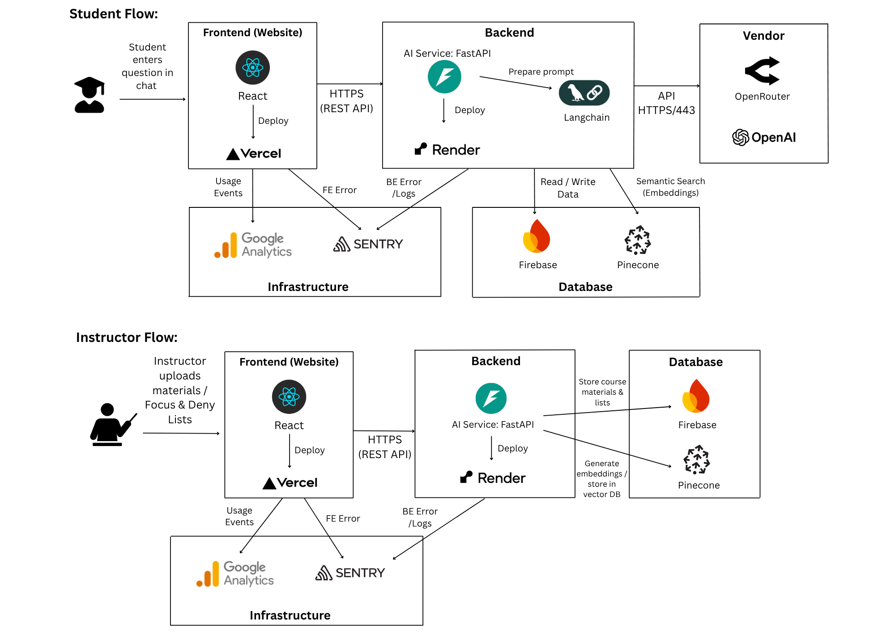

# Architecture Diagram Explanation

## Diagram

## Explanation
Our MVP system is a modular web application that supports both students and instructors on a shared architecture. The platform consists of a **Next.js** frontend deployed on **Vercel**, a **FastAPI** backend deployed on **Render**, **Pinecone** for semantic search, optional **Firestore** for session and quiz persistence, and LLM integrations via **OpenRouter**. We use **Google Gemini** as the primary embeddings provider. This setup lets us iterate quickly while keeping hosting and DevOps overhead low.

### Frontend: Next.js on Vercel + Jest
We use Next.js to build both student- and teacher-facing interfaces. Students interact with learning modules, progress tracking, and AI tutoring, while teachers use dashboards for course management and monitoring. 
We test key UI flows with Jest (run automatically in CI), which provides fast feedback on regressions before changes are deployed. Hosting on Vercel provides instant deployments, preview environments, and global CDN delivery.
Trade-off: Vercel simplifies frontend deployment but advanced backend logic must be hosted separately.

### Backend: FastAPI on Render + pytest
FastAPI serves as the backend, exposing APIs for authentication, course management, progress tracking, and AI-powered features. Backend correctness is validated with pytest tests and coverage reporting in CI so that core features remain stable as we add code.
Render was chosen for its developer-friendly deployment, GitHub integration, and auto-scaling.
Trade-off: Offers less control than AWS/GCP, but accelerates MVP development and iteration.

### Database: Firestore
Firestore stores users, courses, assignments, submissions, and progress data. Its real-time sync capabilities enable live dashboards for teachers and responsive feedback loops for students.
Trade-off: Firestore’s NoSQL design makes it less suitable for complex relational analytics, but it’s ideal for MVP needs.

### Vector Store: Pinecone
Pinecone stores embeddings of course content, resources, and student/teacher queries, enabling semantic search and personalized AI recommendations.
Trade-off: Vendor dependency, though alternatives like pgvector remain open for future use.

### AI Integration: OpenRouter / OpenAI APIs + Google Gemini
The backend integrates with LLM providers via OpenRouter, powering student tutoring, Q&A, feedback generation, and teacher-side summaries or insights. The system uses **Google Gemini** (Google Generative AI) to generate embeddings, which are then stored in Pinecone for downstream retrieval and reasoning.
Trade-off: Dependence on third-party APIs introduces latency, cost, and vendor risk, but allows rapid delivery of AI features without model hosting.

## Alignment with Use Cases
1. **Students**  
   - Students access the app via the Next.js frontend.  
   - They ask questions or take quizzes; the frontend calls FastAPI, which retrieves context from Pinecone and calls LLMs via OpenRouter.  
   - Students receive streamed responses and adaptive quiz questions, and session state and results can be stored in Firestore when configured.

2. **Instructors**  
   - Instructors upload slides/PDFs and configure quizzes through the same Next.js frontend.  
   - FastAPI ingests documents, generates Gemini embeddings, and stores them in Pinecone for later retrieval in both chat and quiz flows.  
   - Instructors review quiz definitions and student activity driven by Firestore data and Pinecone-powered insights, closing the loop with the student-facing adaptive chat and quizzes.

