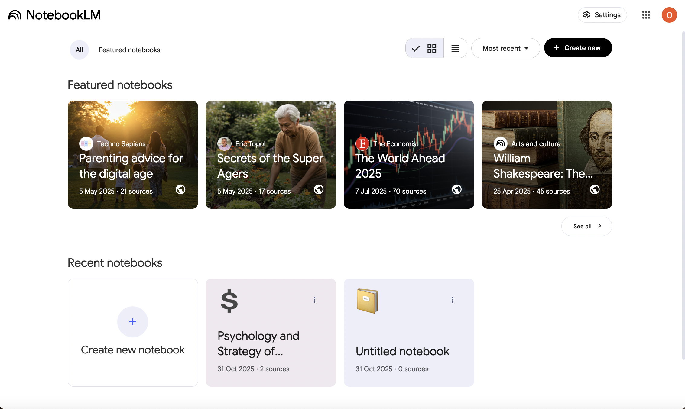
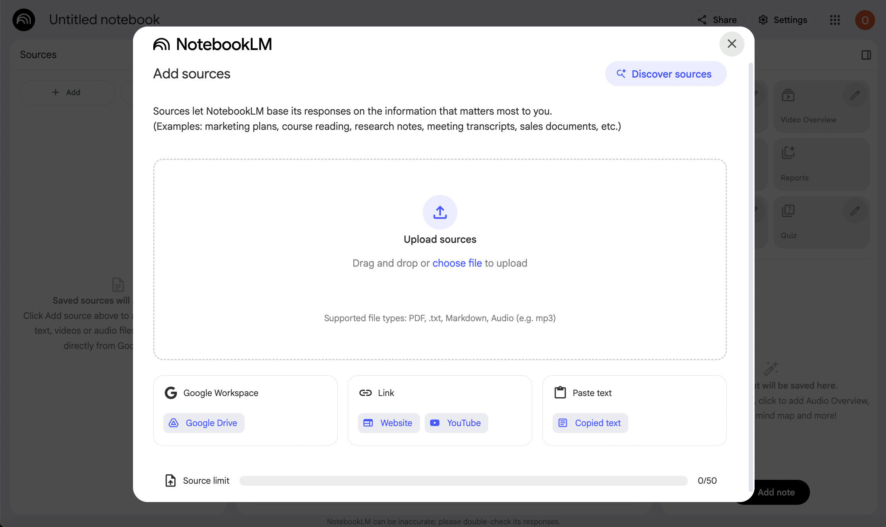
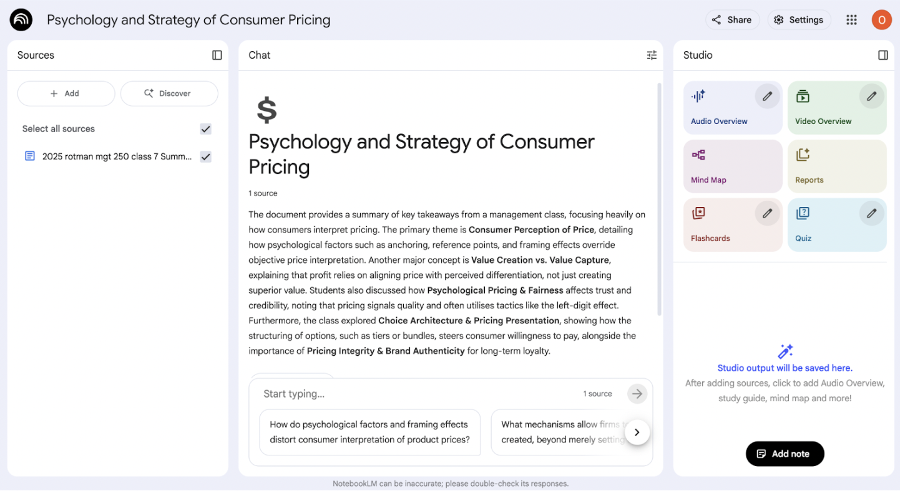
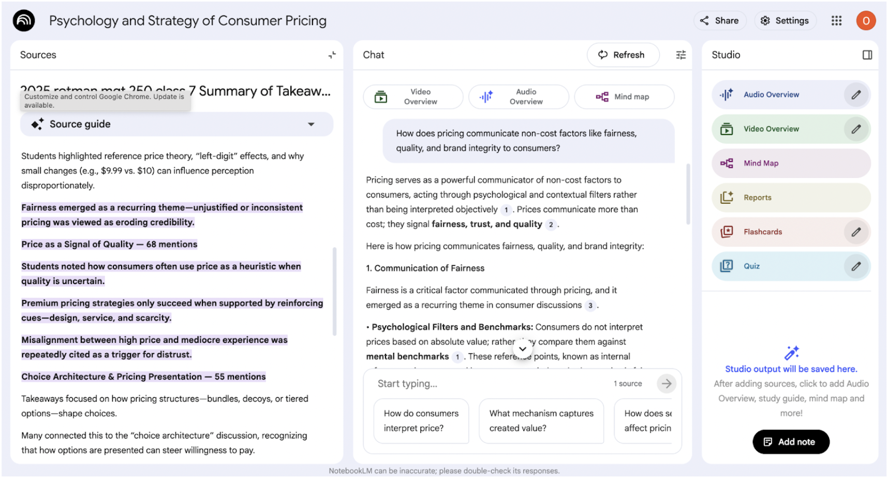
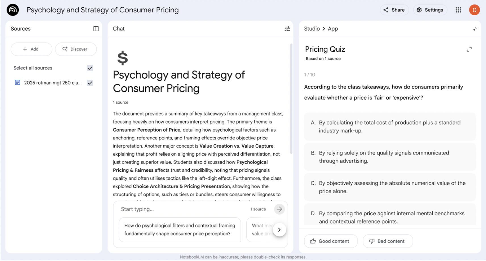
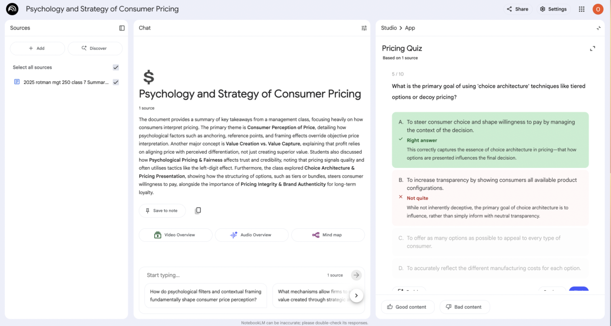
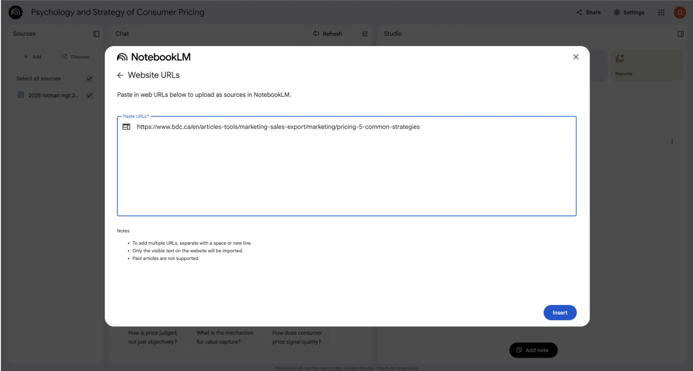
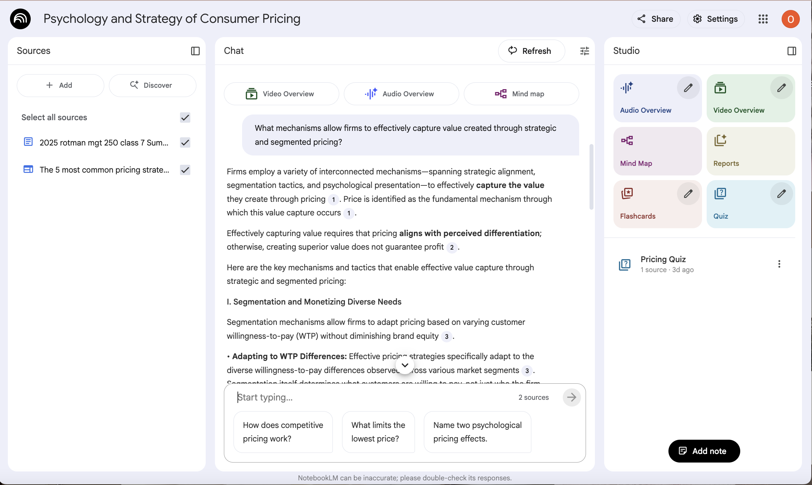
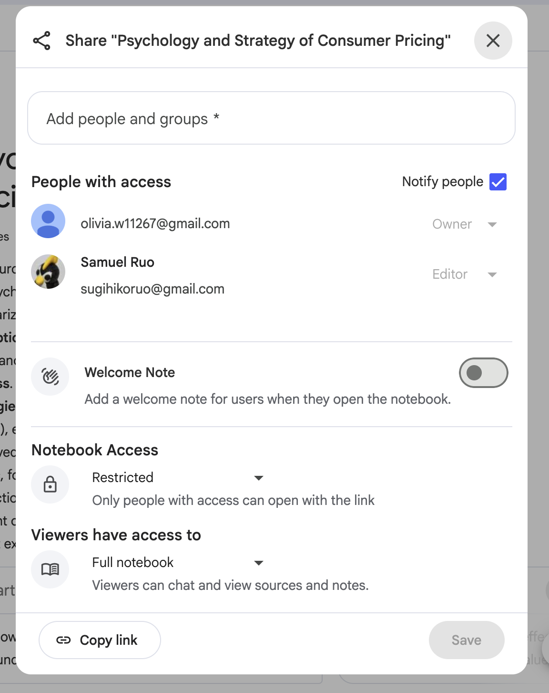

# **Assignment 7 - Competitive CUJ (NotebookLM)**
## CUJ Document

**Link to NotebookLM notebook:** https://notebooklm.google.com/notebook/c5f2f400-d3b5-41f8-8fb0-dfa22b632c6c

### Group Details:
**Group Name:** Horizon Labs

**Student Names and Numbers:**
- Vivian Song, 1008816943
- Olivia Wong, 1009076526
- Samuel Ruo, 1007676846
- Jiajun Li, 1008866470

**Submission Date:** November 9, 2025

### TL;DR 
NotebookLM is an AI-powered research assistant and notebook. It ingests documents (PDFs, Google Docs, websites) and uses a grounded language model to summarize, answer questions, and generate creative outputs. Exploring NotebookLM gave us valuable insight into the GenAI tools students have access to. This includes areas to learn from like UI design/flows, and areas where we suit student learning better like learning specific insights.

### User Goal
As an undergraduate student, I want to achieve a deep, accurate understanding of my course materials and track my mastery over time, so that I can study efficiently, identify gaps early, and perform confidently on classwork and exams.

### Summary of Findings
#### User Persona
* **Name & Role:** Maya Chen — 4th-year CS undergrad; junior developer evaluating study tools for a course project.
* **Expertise Level (LLMs):** Baseline user. Comfortable with ChatGPT/Gemini for summaries/brainstorming; no formal prompt-engineering skills; limited understanding of RAG internals.
* **Platform Familiarity:** First-time NotebookLM user; familiar with utilizing external files with AI tools; no prior notebook-centric AI tools.
* **Devices & Materials:** Chrome on a MacBook laptop. Utilized course materials (PDF) and external web article.
* **CUJ Goals:** Upload course materials, get grounded summaries and cited Q&A, create quizzes for practice, and check reasoning against sources.
* **Behaviors & Preferences:** Uses natural-language prompts; expects clear UI, visible citations, and per-source scoping; compares outputs to syllabus/notes.
* **Constraints & Pain Points:** Limited study time; confusion if web content mixes with course files; uncertainty when citations are partial/missing.
* **Success Criteria:** Fast Notebook setup, quote-level citations, track/share learning progress, and reliable answers without prompt “hacks.”

#### Tools Used
* **NotebookLM** — AI summarization, chat, and report generation
* **Chrome + Google Search** — find and open external sources
* **Course materials (PDFs, notes, slides)** — external reference content

#### Highlights and Lowlights Table
| Task                                          | Severity     | Notes                                                                                                                                                                                                                            |
| --------------------------------------------- | ------------ | -------------------------------------------------------------------------------------------------------------------------------------------------------------------------------------------------------------------------------- |
| Onboarding, upload & auto-summary             | **Great**    | Google SSO made signup simple; upload flow is intuitive; auto-summary provides quick key points, though it lacks page-level citations.                                                                                           |
| Chat over sources (single & multi-source)     | **Great**    | Answers were coherent and grounded with citations; choosing which sources to include when generating content was straightforward and worked well for targeted questions.                                                         |
| Cross-check with web                          | **Moderate** | Most claims aligned with external references, but extra verification was needed due to inconsistent citation clarity/coverage.                                                                                                   |
| Quiz generation                               | **Severe**   | “Generate quiz” stalled and required a page refresh before the quiz appeared (likely a transient glitch).                                                                                                                        |
| Quiz feedback/explanations                    | **Great**    | Explanations were concise and helpful, often quoting source lines to highlight missed details.                                                                                                                                   |
| Citation coverage & clarity                    | **Moderate** | Not all generated outputs include citations; multi-source replies used numbered refs only (unclear attribution); after adding a second source the summary didn’t refresh, creating minor mismatch—prompting manual cross-checks. |
| Quiz controls                                 | **Moderate** | Quiz allows for custom topics/requests and has difficulty levels; however for size it uses “fewer/standard/more” rather than an exact number, limiting precision/flexibility in format.                                                                                                                |
| Sharing & analytics                           | **Moderate** | Features functionally work but are oriented toward personal research; limited instructional guardrails and learning-focused insights for classroom use.                                                                          |

#### Product Recommendations
Overall, NotebookLM is a powerful tool for students and those looking to strengthen their knowledge of specific materials. However, there are 3 specific areas where we make recommendations.

##### 1. Sharing and Collaboration

NotebookLM allows users to share their notebooks/workspaces; however, there is limited control over what is shared. You can either share only the chat without the sources displayed or the “full notebook”. However, when sharing the full notebook, users are only able to interact with modules (quizzes, videos, flashcards, etc.) previously generated by the owner. They are not able to create new modules, which could limit a user’s ability for individual sustained practice.

**Recommendations**

* Add another sharing level that allows shared users a similar level of control to the owner.
* Give the owner the ability to customize the sharing of individual components/controls and **preview** what they share.

##### 2. Sources & Citations

A clear strength of NotebookLM is its RAG-based implementation, which allows users to control what information is being used in generated content. However, it is not always clear which specific sources are being used, as citations are only given in the chat feature.

**Recommendations**

* Add a feature that lets the user uncover which specific sources—or parts of sources—are used in different parts of **all** content generation.
* For quizzes, supplement the correct answer for each question with a citation showing where this is answered in the source material.

##### 3. Controls and Analytics

NotebookLM provides users with excellent control over generated content. However, some controls could be better. For example, quizzes do not allow you to specify a specific number of questions, but rather “fewer”, “standard”, and “more”. NotebookLM also falls a bit short when it comes to transparency and analytics. While it does offer analytics, these are more for engagement with the notebook/workspace rather than insights into the learnings of individual users.

**Recommendations**

* Allow explicit controls (e.g., set an exact number of quiz questions).
* Expand analytics beyond engagement to include insights into individual learning (e.g., progress, gaps, misconceptions).

---

### Competitor Product Analysis
**Where NotebookLM shines.** NotebookLM makes it easy to get started through Google SSO. Its design as a grounded, RAG-based application provides students with assurance that generated content aligns with their course materials. The upload–chat–generate flow takes just a few clicks—no need to craft prompts—making the LLM very easy to use. In the right hands, this can greatly increase learning comprehension and efficiency. The **source toggle**, in particular, was a powerful feature for content generation and could inform the instructor side of our application in the future.

**Where it falls short for our use case.** In general, NotebookLM’s focus as a research assistant limits its ability to address the complete needs of students and instructors. In the wrong hands, the wide variety of content-generation features can **shortcut learning**. Citation coverage and clarity are inconsistent across some outputs (e.g., quiz questions/answers; citations can be unclear due to reformatted source material), which forces manual cross-checks. The platform’s lack of specificity in content generation (e.g., exact number of quiz questions) and in its sharing features makes it weaker as a direct collaborative platform. Finally, while instant feedback is available (e.g., quiz answers and explanations), the analytics lean toward engagement (like YouTube) rather than insights into users’ learning.

**How our product compares.** With this in mind, our platform wouldn’t include such a wide variety of content-generation options or research-specific features like engagement analytics. Instead, it is optimized for responsible learning and classroom visibility. We do this through our adaptive, **explain-first** learning chat feature/CUJ and through learning analytics derived from quiz results and chat interactions. In addition, with **instructor-adjustable** parameters for content generation and **direct citations**, we remove the guesswork for students about what constitutes valid and effective AI use.

### CUJ Overview Table
*Tasks covered:* Onboarding & setup; Orientation & first Q&A; Verification via web; Assessment (quiz) flow; Multi-source ingest & reasoning; Analytics & sharing.

| Task                                        |  Time | Switches |
| ------------------------------------------- | ----: | -------: |
| Onboarding & setup (Steps 1–2)              |  5:00 |        3 |
| Orientation & first Q&A (Steps 3–4)         |  7:00 |        0 |
| Verification via web (Step 5)               |  8:00 |        2 |
| Assessment (quiz) flow (Steps 6–7)          | 20:00 |        0 |
| Multi-source ingest & reasoning (Steps 8–9) |  6:00 |        2 |
| Analytics & sharing (Steps 10–11)           |  8:00 |        2 |

**Total time:** 54:00
**Total context switches:** 9

### End-to-End User Journey
*Note: This CUJ was extended (steps 10 and 11) after the presentation to include relevant interactions missed in the first walkthrough.*

| Step | Notes | Screenshot |
|:---:|:--|:--:|
| 1 | **Time:** 3:00 **Context Switches:** Google Search → NotebookLM **What:** Searched “NotebookLM,” opened the official site, signed in with Google, accepted permissions, and landed on the dashboard with a clear **+ New notebook** button. **Why:** Quickly establish an account to evaluate onboarding friction. **Issues:** None observed. **Severity:** Great |  |
| 2 | **Time:** 2:00 **Context Switches:** NotebookLM → Finder (file picker) → NotebookLM **What:** Clicked **+ New notebook**, chose **Upload files**, selected the course PDF in Finder, and confirmed upload. NotebookLM parsed the file and auto-generated a brief summary with clear **Upload** and **Chat** affordances visible. **Why:** Ground the workspace in course material to enable cited Q&A and validate ingest/summary UX. **Issues:** None. **Team learning & takeaway:** Provide more file-type options in future. **Severity:** Great |  |
| 3 | **Time:** 4:00 **Context Switches:** None **What:** Reviewed the auto-generated **Summary** showing 4–5 key points extracted from the uploaded PDF to get a quick overview before chatting. **Why:** Rapid orientation and to confirm ingest quality prior to asking targeted questions. **Issues:** No page-level/quote-level citations or links back to passages in the Summary. **Team learning & takeaway:** Add page/quote citations or “jump to passage” in summaries. **Severity:** Great |  |
| 4 | **Time:** 3:00 **Context Switches:** None **What:** Asked in **Chat**: “How does pricing communicate non-cost factors like fairness, quality, and brand integrity to consumers?” with the uploaded PDF selected as the source; reviewed a coherent answer with inline citations aligned to the file. **Why:** Assess grounded Q&A quality, alignment with course material, and citation behavior. **Issues:** None. **Severity:** Great |  |
| 5 | **Time:** 8:00 **Context Switches:** NotebookLM → Google Search (external article) → NotebookLM **What:** Opened a new tab, searched key terms from the chat answer, reviewed 1–2 credible sources, and compared points with NotebookLM’s citations and the original PDF. **Why:** Validate the grounded answer against independent references and check for hallucinations/misinterpretations. **Issues:** Extra verification required due to inconsistent citation clarity (numbered refs, no page-level cites). **Team learning & takeaway:** Prefer explicit source names and passage previews to reduce verification time. **Severity:** Moderate |  |
| 6 | **Time:** 5:00 **Context Switches:** None (in-app refresh) **What:** Clicked **Generate quiz** to create 10 MCQs from the uploaded PDF; loading stalled for ~15 seconds; refreshed the page and the quiz appeared. **Why:** Test comprehension workflow and evaluate assessment UX/performance. **Issues:** Generation hang requiring manual refresh; no visible progress/retry state; coarse size controls (e.g., “fewer/standard/more”) instead of exact count. **Team learning & takeaway:** May need to watch out for performance issues with RAG generation in our own quiz feature. Look to possibly add progress + retry/cancel, surface transient errors, and allow explicit question counts to reduce uncertainty. **Severity:** Severe |  |
| 7 | **Time:** 15:00 **Context Switches:** None **What:** Completed the quiz and used **Explain** on incorrect answers to review reasoning; explanations quoted relevant lines from the PDF and clarified mistakes. **Why:** Diagnose misunderstandings and reinforce key concepts directly from source material. **Issues:** None. **Team learning & takeaway:** NotebookLMs hand off from Quiz to Chat is seamless and may be something we want to look to have in our own system. **Severity:** Great |  |
| 8 | **Time:** 2:00 **Context Switches:** NotebookLM → Google Search → NotebookLM **What:** Opened a new tab to find a relevant website, then added it as a source in the notebook; the source was ingested successfully, but the **Summary** did not auto-refresh. **Why:** Test multi-source ingest and readiness for merged reasoning across course material and an external article. **Issues:** Summary didn’t update after adding the new source, causing a minor mismatch with current sources. **Team learning & takeaway:** NotebookLMs UI and flow to toggle different sources is great and something we could look to include on the instructor side of our platform. **Severity:** Great |  |
| 9 | **Time:** 4:00 **Context Switches:** None **What:** Asked in **Chat**: “What mechanisms allow firms to effectively capture value created through strategic and segmented pricing?” with both sources selected; reviewed a merged answer drawing from the PDF and the added website. **Why:** Evaluate multi-source reasoning quality and how citations support verification. **Issues:** In-text citations were numbered only—no explicit source names making attribution unclear and verification slower. **Team learning & takeaway:** May need to figure out a better way of quickly identifying sources in any generated content on our platform. **Severity:** Moderate |  |
| 10 | **Time:** 5:00 **Context Switches:** NotebookLM → Google Search (analytics info) → NotebookLM **What:** Opened the notebook’s activity/insights panels, then searched the web for details on what analytics NotebookLM offers; returned to review in-product metrics (counts of chats/modules, recent activity) and looked for exports, cohort views, or per-learner progress. **Why:** Determine whether analytics provide learning insight (mastery, misconceptions, progress) versus engagement-only tallies, and assess classroom suitability. **Issues:** Metrics skew toward engagement. **Team learning & takeaway:** Prioritize learning analytics and role-based dashboards over engagement counts. **Severity:** Moderate |  |
| 11 | **Time:** 3:00 **Context Switches:** None **What:** Opened **Share** in the notebook, reviewed options (Chat-only vs Full notebook), and inspected link settings. Couldn’t find per-module controls or generation permissions, and there was no share preview of what recipients would see/do. **Why:** Evaluate whether sharing supports classroom collaboration and instructor control. **Issues:** Limited granularity; unclear recipient capabilities; no extensive role-based permissions. **Team learning & takeaway:** Add role-based sharing with per-module permissions and a share preview. **Severity:** Moderate |  |

