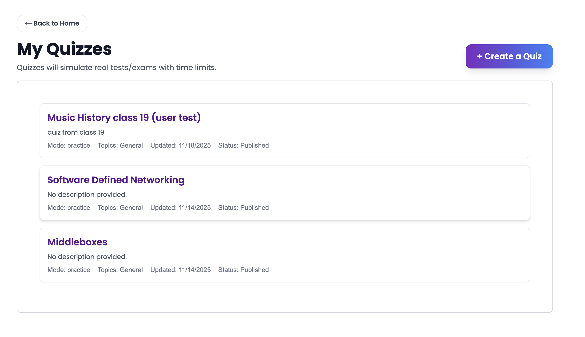
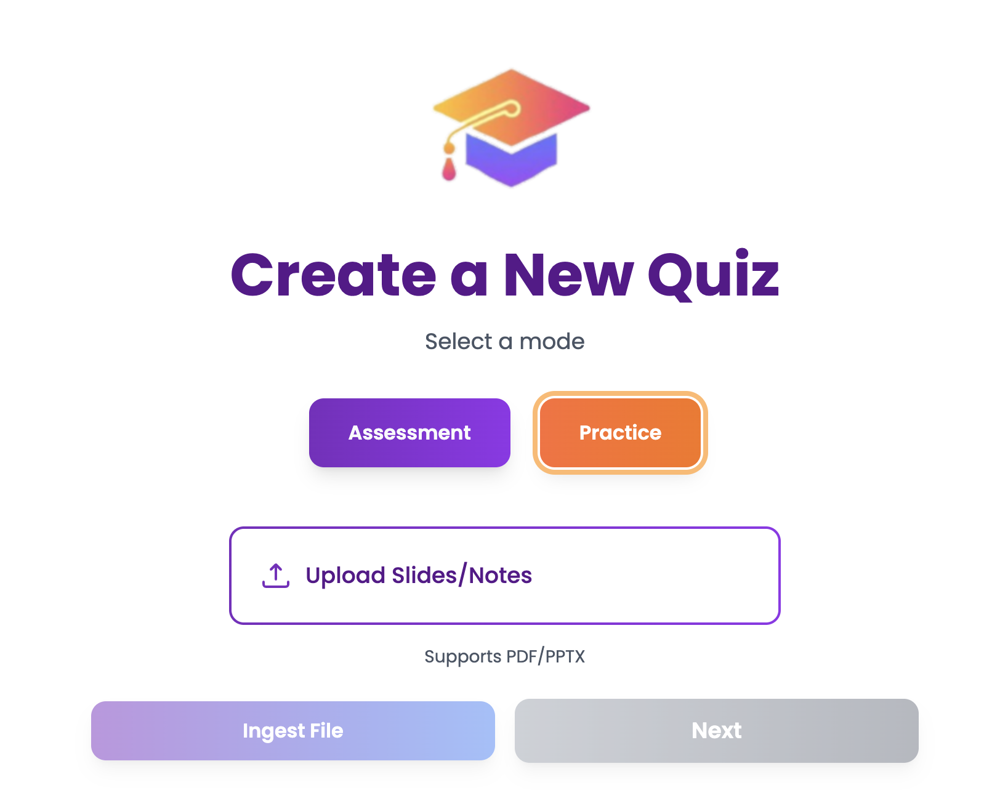
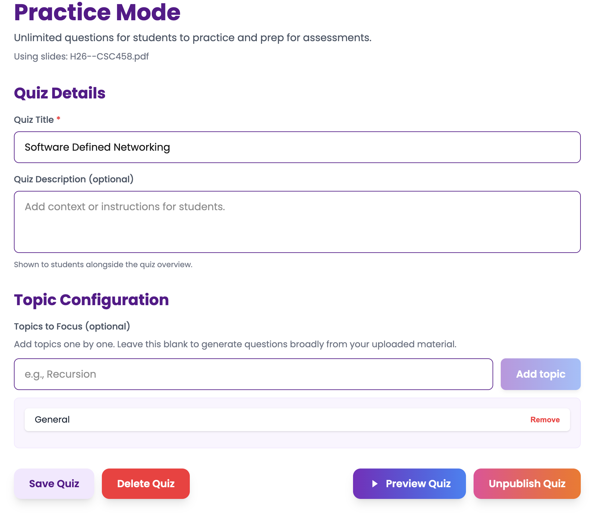
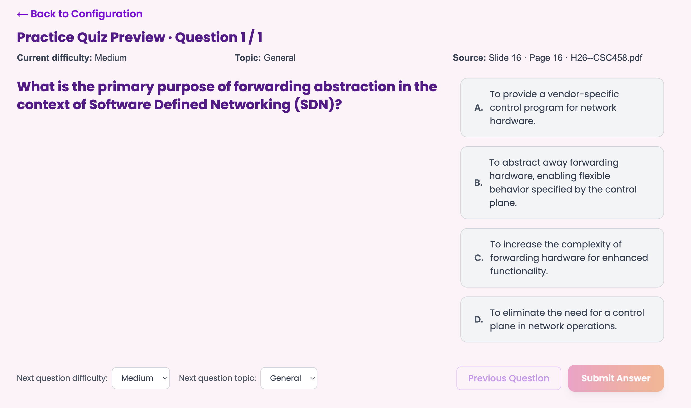
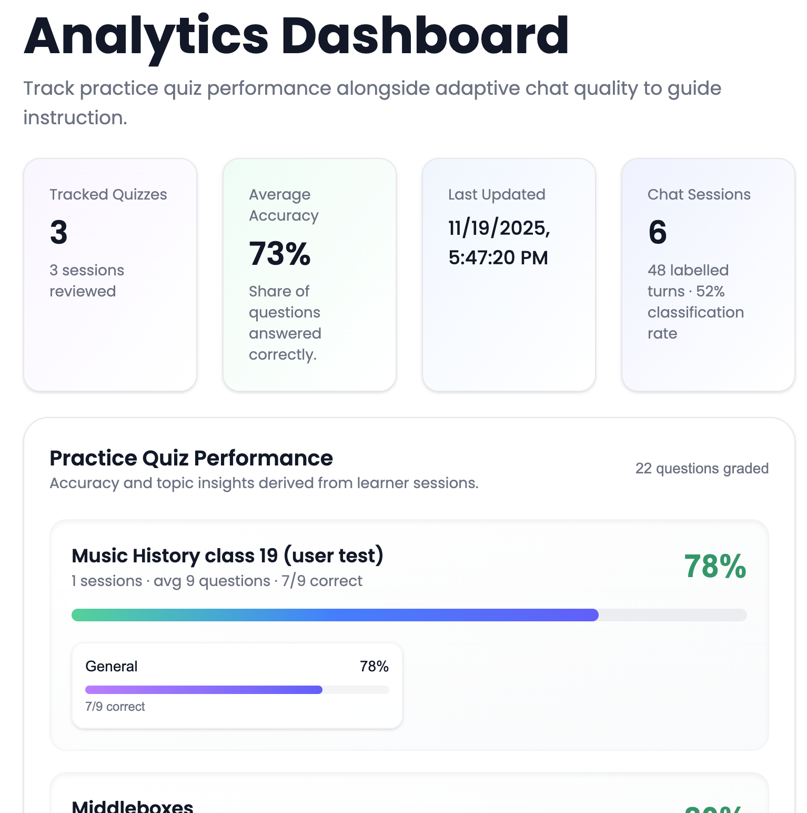
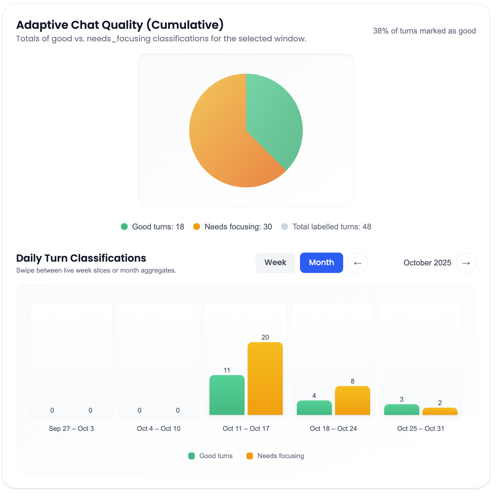

Session Overview
- **Researcher:** 
- **Date:** 2025-11-18
- **Participant initials/profile:** J.W. (friend acting as an instructor persona)
- **CUJ title:** Trying to hand out a quiz that aligns with the course material and see the learning feedback from students with automotive LLM (Instructor CUJ 1 & 2)
- **Scenario narrative:** J.W. is using the LearnLLM platform for uploading the course material and has a place for students that review or ask questions that align with the course. He needs an auto tool for him to publish course-related quizzes and see feedback from the student about how their learning process is going, as well as their chat situation.
- **Application build / version:** A9 - Demo 4
- **Test environment & devices:** Windows 11 PC, Chrome Browser, Using [hosted version](https://horizon-labs-code.vercel.app/) of LearnLLM

## Goals & Hypotheses
- **Primary objectives:** 
  - Assess how intuitively the user can navigate and understand the process of uploading materials and publishing a quiz.
  - Evaluate how the dashboard analytic affect the user's teaching direction.
  - Observe J.W.’s interaction with the Quiz generator and feelings about the quiz generated
- **Success criteria / metrics:**
  - Estimated time taken to upload material, publish a new quiz, and understand the features of the analytics (with limited guidance).
  - Quality of quizzes generated by AI responses (measured by J.W.'s feedback on the completeness and effectiveness of the quizzes).
- **Key hypotheses:**
  - H1: J.W will find the see the quiz generator intuitive and easy to navigate without extensive guidance.
  - H2: The analytics dashboard will help J.W. see the situation of the students in their chat, and reflect the learning quality on some topic through quiz grades.
  - H3: J.W will be able to get direction on adjusting the lecture or course structure through the feedback summarized from the dashboard analytics.
- **Open questions / risks:**
    - Would J.W. think the AI-generated quiz useful, especially think it reflects the real learning situation of the students??
    - Are there any specific features or improvements that could better help J.W.’s teaching?
## Participant Background
- **Relevant context (experience, motivation, constraints)**
    - J.W. was given the persona of an instructor who regularly uses digital teaching tools but has limited experience with AI-powered education platforms.
    - They are motivated to find tools that support student learning and identify areas where students struggle.
- **Prior experience with similar products / tasks:**
  - Have heard students using ChatGPT, and have used ChatGPT sometimes for quick responses in unfamiliar areas.
- **Prior familiarity with our product / domain:**
  - None; this is J.W.'s first interaction with LearnLLM.

## Task Script & Observations
1. **Pre-Task Briefing**
   - Researcher explains the purpose of the session, ensuring J.W. understands he is testing the product, not their own abilities.
   - J.W. is informed they can think aloud and express any thoughts or frustrations during the session.
2. **Task Introduction**
   - Researcher introduces the specific task J.W. will be working on during the session.
   - J.W. is encouraged to ask questions if they need clarification on the task.
3. **Task Execution**
    - J.W. is given the scenario: "You need to create a quiz through the LearnLLM platform, and it must be related to the material you uploaded to the platform. And publish it so the students can see. And after the students finish answering, you need to see the analysis of their results in the LeanLLM platform."
    - J.W. begins by navigating to the instructor homepage and navigating to the quiz generator.
    - Researcher observes J.W.'s interactions, noting any hesitations, questions, or comments made during the task.
    - J.W. uploads one of the lecture slides, configures the quiz topic, and then publishes. 
    - J.W., go back to the homepage and navigate to the dashboard, and see the result of this quiz, like the share rate of the correctness of each topic.
    - Researcher takes detailed notes on J.W.'s behavior, including:
      - General time taken to complete each step.
      - Any points of confusion or frustration.
      - Positive reactions or moments of clarity.
      - Suggestions or feature requests made by J.W.
4. **Post-Task Debriefing**
   - The researcher conducts a debriefing session with J.W. to gather feedback on their experience.
   - J.W. is asked about their thoughts on the quiz generation process, the features that the quiz generator allows, Dashboard clarity, and the overall experience.

### Task Step:
**1) Task 1: Exploration and Initial Interaction**
- **Prompt given:** Explore the platform and locate the instructor tools for uploading course materials and generating a quiz.
- **Expected outcome:** J.W. successfully navigates the instructor homepage, identifies where course materials can be uploaded, and locates the quiz generator without assistance.
- **Actual path taken:** J.W. briefly scans the homepage, clicks into the “Instructor” panel, and quickly identifies the “Upload Material” and “Create Quiz” sections. He comments on the clean layout and finds the entry points intuitive.
- **Time on task (if tracked):** Approximately 1.5 minutes
- **Direct quotes / notable reactions:**  "It is clear, and easy for me to find the features." 
- **Usability issues or friction points:** 
  - Mild hesitation when deciding whether to upload slides first or click directly into “Create Quiz.” 
  - Initially expected a tooltip or brief description explaining the purpose of each section.

- **Unmet needs or feature requests:**
  - Requested a small “?” icon or hover explanation: “Upload your slides here to generate quiz questions.”
  - Suggested a short onboarding banner for first-time users.

**2) Task 2: Uploading Material and Generating a Quiz**
- **Prompt given:** Upload a lecture slide deck, configure a quiz based on it, and publish the quiz so students can access it.
- **Expected outcome:** J.W. uploads his slides, selects a topic or chapter, generates AI-produced questions, reviews them, and publishes the quiz.
- **Actual path taken:** J.W. selects a PDF lecture file, uploads it successfully, and watches the “processing” state. He then configures topic tags and difficulty levels, reviews the generated MCQs, and publishes the quiz. He verbally evaluates the relevance and accuracy of each question.
- **Time on task (if tracked):** Approximately 7 minutes.
- **Direct quotes / notable reactions:** “Very fast and clear steps for creating a quiz, the preview quiz function is good, and the quality of the quiz is actually not bad” 
- **Usability issues or friction points:**
  - Confused briefly when the tagging input field didn’t autofill suggested topics.
  - Expected a clearer indicator of progress during slide ingestion (e.g., % complete).
  - Unsure whether editing a question would regenerate distractors or only modify text.

- **Unmet needs or feature requests:** 
  - Ability to preview the specific slide or text snippet that produced each question.
  - Option to manually reorder generated questions.
  - A “draft mode” before publishing.

**3) Task 3: Reviewing Analytics and Interpreting**
- **Prompt given:** Navigate to the dashboard to review student performance on the newly published quiz and interpret the correctness breakdown by topic.
- **Expected outcome:** J.W. locates the analytics dashboard, understands the visualizations, and forms an opinion on how he might adjust teaching based on student performance.
- **Actual path taken:** After publishing, J.W. returns to the instructor homepage, opens the Dashboard tab, and examines the correctness distribution chart and topic-level summaries. He spends time hovering over visual elements and interpreting what each value means.
- **Time on task (if tracked):** Approximately 4 minutes.
- **Direct quotes / notable reactions:** "Having a summary of the students’ learning situation is really great, I can see which topic I may need to focus more on when I teach." "It would be great if I could see more detailed analytics on students’ performance over time."
- **Usability issues or friction points:** 
  - Confusion around what “share rate correctness” represents (aggregate vs. per-topic).
  - Wondered whether chat analytics and quiz analytics were connected or separate.
  - Missed a legend explaining each chart type.

- **Unmet needs or feature requests:**
  - Clearer labels on analytics charts.
  - Integration between chat-session diagnostics and quiz performance (e.g., “Students who  asked questions about X scored lower on X”).
  - A downloadable report summarizing key insights.

## Wrap-Up Interview
- **Overall satisfaction (verbatim + inferred rating):** "Overall the quiz generator is a good tool for me to use and does its job, and the dashboard is straightforward for me to see the analytics. Hopefully, there could be more features in the future" (4/5)
- **Biggest pain point:** Too few configurations for him to adjust when creating the quiz.
- **Favorite moment / value highlight:** Dashboard analytics points out the weak points of the students
- **Suggestions from participant:** "Maybe some extension features in the future on the quiz configuration would be useful."
- **Additional questions asked:** N/A

## Researcher Reflections
- **Key insights:** 
 - The quiz feature shows strong potential as a practice tool, but accuracy and relevance of questions are crucial for user trust and satisfaction.
 - Users may benefit from more control over question generation to ensure alignment with the teacher's expectations.
 - Immediate feedback is highly valued; teachers get feedback soon and can adjust quickly.

- **Surprises vs. hypotheses:** All hypotheses are confirmed, H1: J.W. finds the quiz generator intuitive and easy to use; H2: J.W. sees the learning situation of the students through dashboard analytics and finds out their weak points; H3: J.W. gets to know which topics in the lectures he needs to focus more on.

- **Impact on roadmap (priority, scope, timing):** We likely do not have the time to implement or make significant changes before MVP, but these findings will inform post-MVP improvements. Focus areas include giving more flexibility in creating the quiz, collecting more data from students, and adding more information to the dashboard analytics.

## Artifacts
- **Screenshots:** See attached screenshots below for session details.

### Session Screenshots
Instructor homepage:

Setting up the quiz using own course material:

Upload and Ingesting the course material:

Configuring the quiz parameters:

Previewing the generated quiz questions:

Reviewing the analytics dashboard (Quiz Results):

Reviewing the analytics dashboard (Chat Results):

