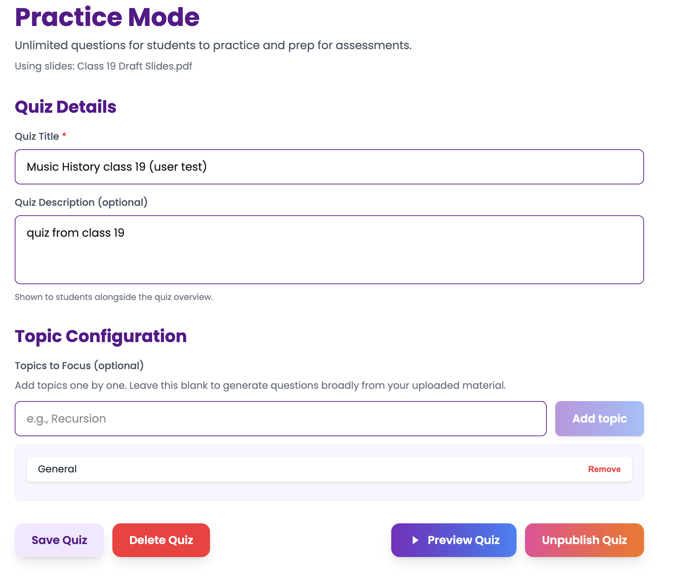
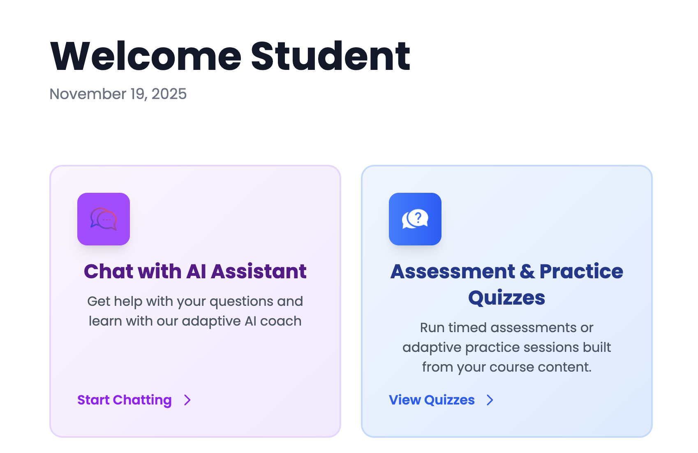
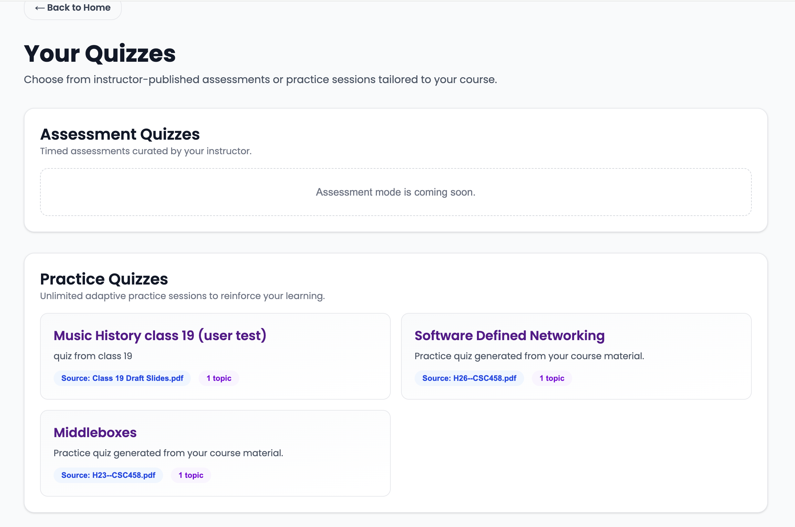
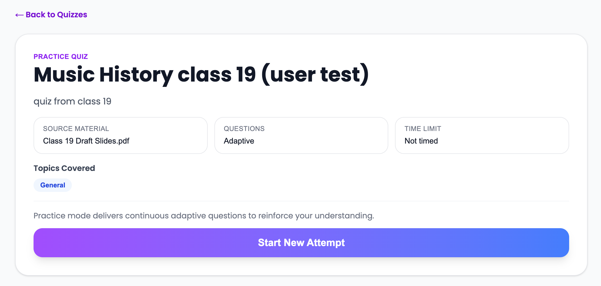
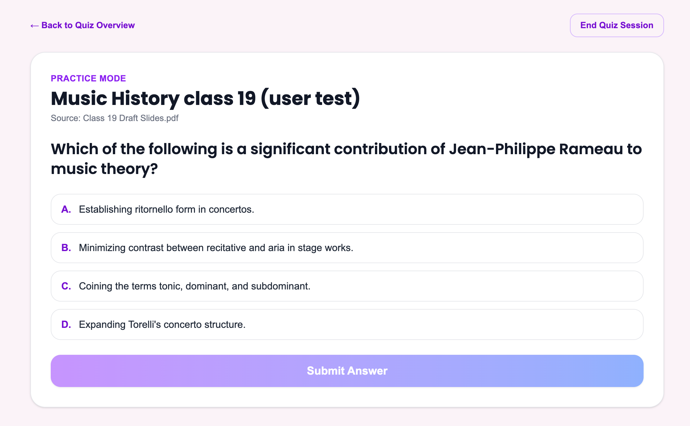
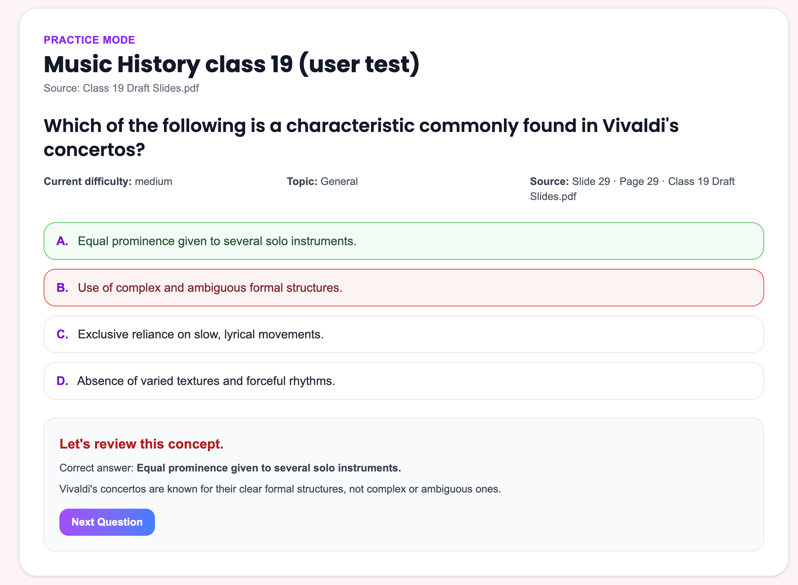
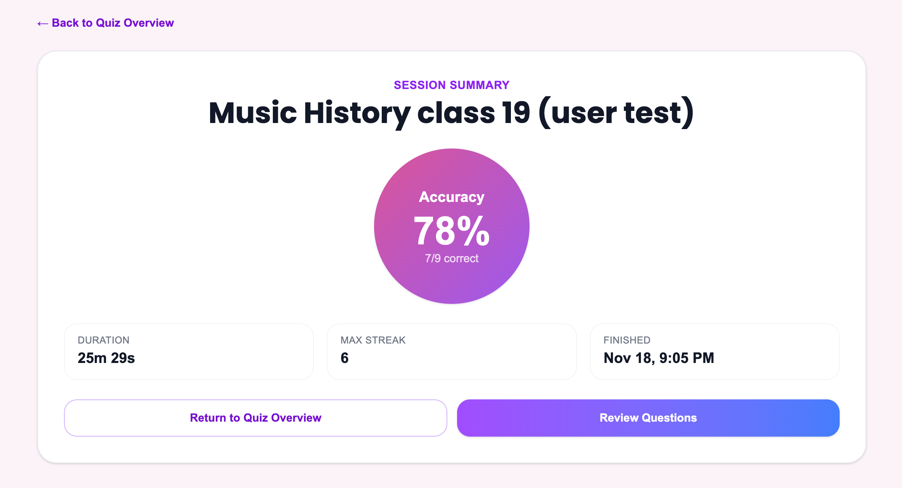
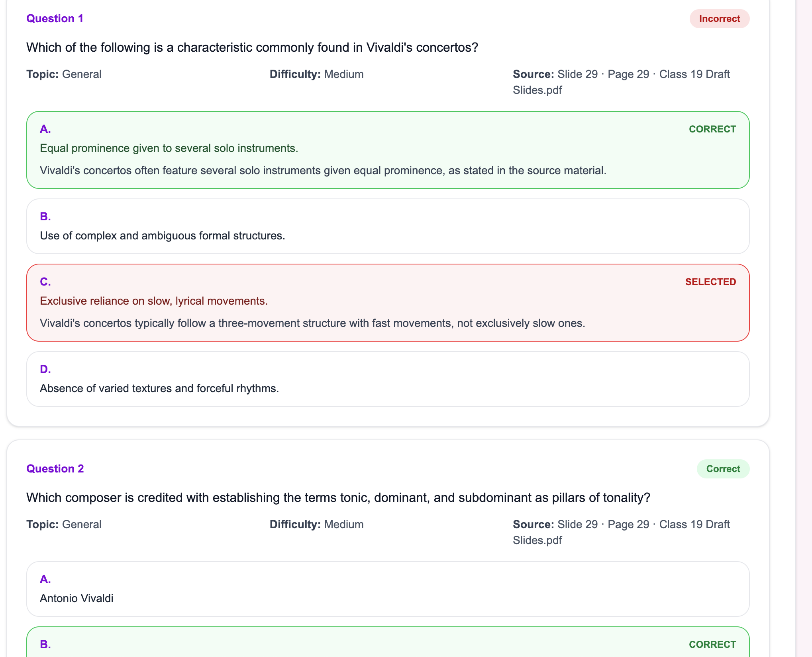
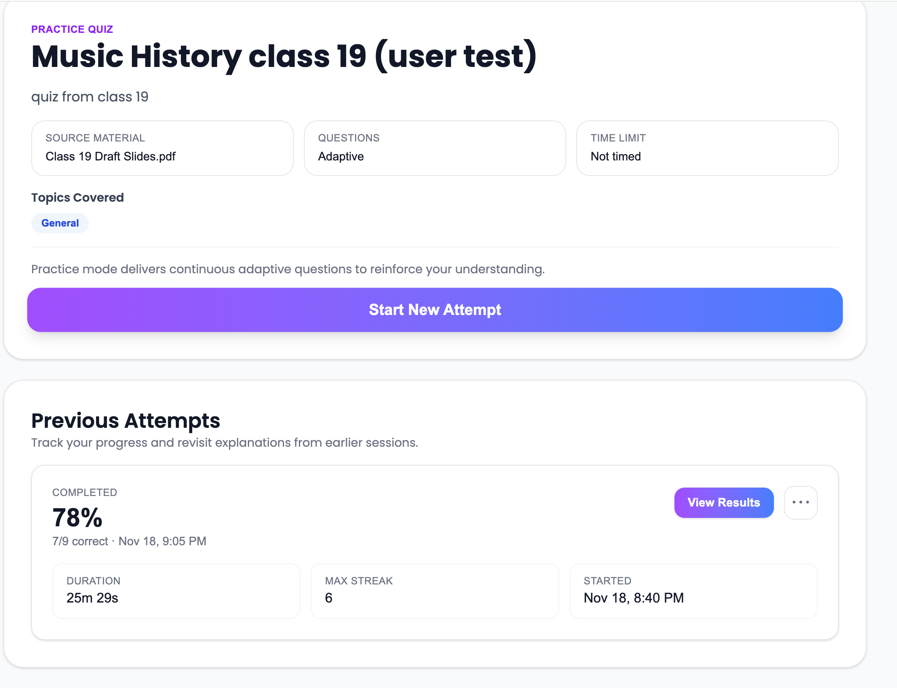

# Student User Research Session – Core Student User Journey 2

## Session Overview
- **Researcher:** Samuel Ruo
- **Date:** 2025-11-18
- **Participant initials / profile:** E.R (Undergraduate, Violin - Music Performance, First Year)
- **CUJ title:** Practicing Music Theory Concepts with LearnLLM Adaptive Chat (Student CUJ 2)
- **Scenario narrative:** E.R is using the LearnLLM platform to practice course material through quizzes generated from their music theory coursework. They aim to reinforce their understanding of topics extending beyond learning done in the adaptive chat.
- **Application build / version:** A9 - Demo 4
- **Test environment & devices:** Windows 11 PC, Chrome Browser, Using [hosted version](https://horizon-labs-code.vercel.app/) of LearnLLM

## Goals & Hypotheses
- **Primary objectives:** 
  - Assess how intuitively the user can navigate and understand the quiz interface (we will partially test the instructor side in uploading and creating the quiz, but focus mainly on the student experience in taking the practice quiz).
  - Evaluate how the quiz feature functions as a practice tool and how it complements the adaptive chat learning experience.
  - Observe E.R's interaction with the quiz questions and their experience using a structured LLM generated output (differing from the open-ended chat format).
- **Success criteria / metrics:**
  - Estimated time taken to create a new quiz (instructor side) and start a quiz session (student side) with limited guidance.
  - Estimated time taken between question generation and overall study session completion (will be set at ~10 questions).
  - Completion of the quiz task (E.R successfully answers all questions and receives feedback).
  - Quality of questions generated from the course material (measured by E.R's ability to answer correctly and provide feedback on question relevance).
- **Key hypotheses:**
  - H1: E.R will find the quiz interface intuitive and easy to navigate without extensive guidance.
  - H2: The quiz feature will effectively reinforce E.R's understanding of music theory concepts learned in the adaptive chat.
  - H3: E.R will be able to answer the quiz questions accurately and find them relevant to their coursework.
- **Open questions / risks:**
    - Will E.R find the quiz questions generated by the LLM relevant and appropriately challenging?
    - Are there any specific features or improvements that could enhance E.R's learning experience (in particular in practice and personalized study)?

## Participant Background
- **Relevant context (experience, motivation, constraints)**
    - E.R is a first-year undergraduate student majoring in Music Performance with a focus on violin.
    - They are familiar with using digital tools for learning but have just started including AI-based platforms in their workflow.
    - E.R is motivated to improve their understanding of music theory efficiently, to excel in their coursework and assessments.
- **Prior experience with similar products / tasks:**
  - Some experience using ChatGPT for general queries, study assistance, and note summarization.
- **Prior familiarity with our product / domain:**
  - None; this is E.R's first interaction with LearnLLM.

## Task Script & Observations
1. **Pre-Task Briefing**
   - Researcher explains the purpose of the session, ensuring E.R understands they are testing the product, not their own abilities.
   - E.R is informed they can think aloud and express any thoughts or frustrations during the session.
2. **Task Introduction**
   - Researcher introduces the specific task E.R will be working on during the session.
   - E.R is encouraged to ask questions if they need clarification on the task.
3. **Task Execution**
    - E.R is given the scenario: "You need to practice music theory concepts for your coursework. Use the LearnLLM platform to take a practice quiz generated from your course material."
    - E.R begins by navigating to the instructor side to create a quiz (with researcher assistance as needed), then switches to the student side to start the quiz session.
    - Researcher observes E.R's interactions, noting any hesitations, questions, or comments made during the task.
    - E.R interacts with the quiz interface, answering questions and reviewing feedback.
    - Researcher takes notes on E.R's behavior, including:
      - General time taken to complete each step.
      - Any points of confusion or frustration.
      - Positive reactions or moments of clarity.
      - Suggestions or feature requests made by E.R.
4. **Post-Task Debriefing**
   - Researcher conducts a debriefing session with E.R to gather feedback on their experience.
   - E.R is asked about their thoughts on the chat interface, the AI tutor's responses, and the overall learning experience.

### Task Step:
**1) Task 1: Creating a Quiz (Instructor Side)**
- **Prompt given:** Explore the platform and create a new quiz based on your music theory course material.
- **Expected outcome:** E.R successfully navigates the platform, uploads course material, creates a quiz, and publishes it for student use.
- **Actual path taken:** Matched expected path. (Reseracher assisted with some clarifications on the upload/ingest process.)
- **Time on task (if tracked):** 5 mins.
- **Direct quotes / notable reactions:** Its pretty straightforward, and is similar to other quiz creation tools I've used (Quizlet)." Note: Right now users own process involves using multiple tools so having it all in one place is convenient. (ChatGPT to generate questions, then copy paste to Quizlet).
- **Usability issues or friction points:**
  - Why use ingest file instead of just upload file? What are chunks?
- **Unmet needs or feature requests:**
  - Text input option for course material (instead of only file upload). Have the option to have finer grain control over generation through text input. Wants more control than is available through file upload and topic selection only.

**2) Task 2: Taking the Quiz (Student Side)**
- **Prompt given:** Take the practice quiz generated from your music theory course material. (Will lead the user in switching sides as this is not an expected common flow for users.)
- **Expected outcome:** E.R successfully starts the quiz session, the system continuously generates questions, and E.R answers them while receiving feedback.
- **Actual path taken:** Started quiz session, answered questions, however had to check slides a few times to confirm questions and answers were correct.
- **Time on task (if tracked):** 25-30 mins.
- **Direct quotes / notable reactions:** "I don't think this questions is competely correct based on what I studied, but it's close." "I like that I get immediate feedback on my answers." "This question is not accurate based on the slides and isn't really relevant to what I need to study." "Having infinite questions is great for practice, I can keep going until I feel confident."
- **Usability issues or friction points:** 
  - Generation is long at the start of the quiz, may cause user to reload the page or think something is wrong.
  - General question generation is dependent on quality of slides, may pose an issue if slides are missing context (makes sense why finer grain control over question generation would be useful here).
    - Slides for one question did not format info. in a way LLM could distinguish, causing a less than ideal question (not fully accurate). Chunk size may also be playing a part here.
  - Despite our attempts some questions were asked repeatedly in different forms. Maybe due to the citation inaccuracies noted below. May need to make randomization stronger or have another way to track asked questions (validation to ensure questions are not repeated).
  - Source citations were not always accurate, may be inconsistent with what was shown in the slides. (This may be a bug in the implementation). Additionally, citation format was a bit clunky to read.
  - Having just slides as source material made some questions too easy to answer, as the incorrect answers were not related enough to the question being asked.
  - Funnily enough in some cases however the questions were high quality and genuinely difficult, showing potential of the feature. (At first thought question was inaccurate, but after cross checking with ChatGPT realized it was correct but just a tricky question.)
- **Unmet needs or feature requests:** 
  - Quizlet notifies the user when a question is being reasked, may be useful to have this feature to avoid confusion.
  - Have some sort of progress bar or indication of how many questions have been asked, and the ability to go back to previous questions to review (while in the session).
  - Difficulty should be capitalized to keep consistency.
  - Maybe letting the user set a predetermined number of questions to be asked in the session. Let student have some level of control over session settings.

**3) Task 3: Ending the session and reviewing past results**
- **Prompt given:** Please end the quiz session, then from the home page review your past quiz results as if you were coming back later to study again.
- **Expected outcome:** End the quiz session, go back to home page, navigate back to the quiz, and review your past results.
- **Actual path taken:** Same as expected.
- **Time on task (if tracked):** 5 mins.
- **Direct quotes / notable reactions:** "Having a summary of my performance is really useful, I can see where I need to focus my studies." "It would be great if I could get more detailed analytics on my performance over time."
- **Usability issues or friction points:** 
- **Unmet needs or feature requests:**
  - In future if quiz could analyze and give info on tendencies (i.e. topics frequently missed) that would be useful for study planning.

## Wrap-Up Interview
- **Overall satisfaction (verbatim + inferred rating):** "Some parts were a bit inconsistent which posed some frustration, but overall I can see this being a really useful tool for practicing concepts outside of class." (3.75/5)
- **Biggest pain point:** Inaccuracies with the citations.
- **Favorite moment / value highlight:** Simplified quiz creation. Low effort for infinite practice questions.
- **Suggestions from participant:** Listed in previous sections. (Mainly in Task 2).
- **Additional questions asked:** N/A

## Researcher Reflections
- **Key insights:** 
  - The quiz feature shows strong potential as a practice tool, but accuracy and relevance of questions are crucial for user trust and satisfaction.
  - Users may benefit from more control over question generation to ensure alignment with their study needs.
  - Immediate feedback is highly valued, reinforcing the learning process.
- **Surprises vs. hypotheses:**  
  - H1 was mostly confirmed; E.R found the interface intuitive with minimal guidance.
  - H2 was partially confirmed; while the quiz reinforced learning, some question inaccuracies hindered the experience.
  - H3 was partially confirmed; E.R could answer many questions correctly but struggled with some due to relevance issues.
- **Impact on roadmap (priority, scope, timing):** We likely do not have the time to implement or make significant changes before MVP, but these findings will inform post-MVP improvements. Focus areas include enhancing question relevance, improving citation accuracy, and adding more user controls for quiz generation.

## Artifacts
- **Screenshots:** See attached screenshots below for session details.

### Session Screenshots
Setting up the quiz using own course material (instructor side):

Switching to student side to take the quiz:

Navigating to the created quiz:

Starting new attempt, creating a new session:

Generating and receiving quiz questions:

Receiving instant feedback and citations:

Ending session and seeing summary of performance:

Reviewing results:

Saved in past attempts for future review:

