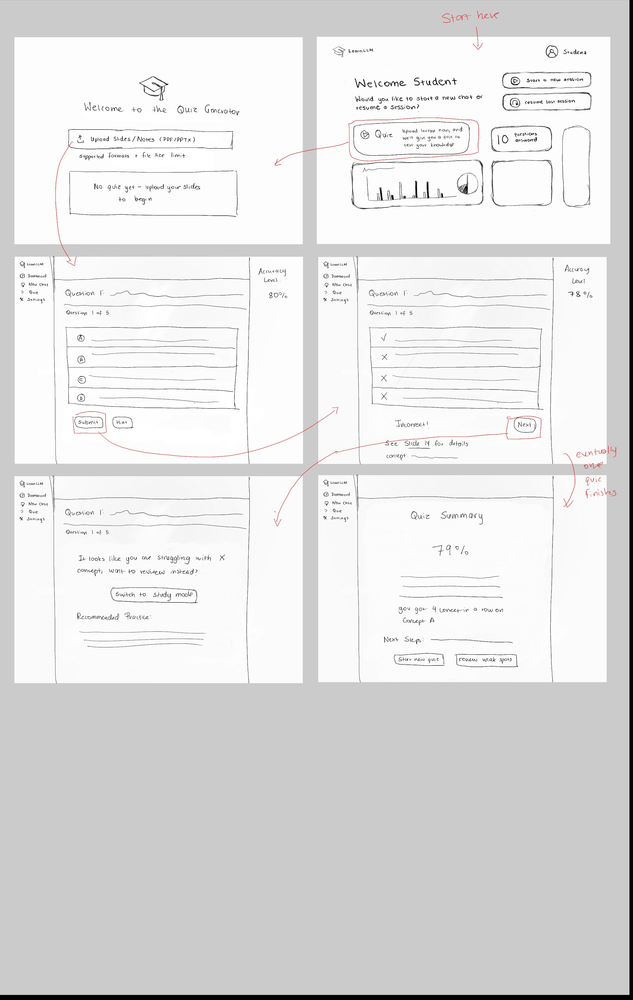
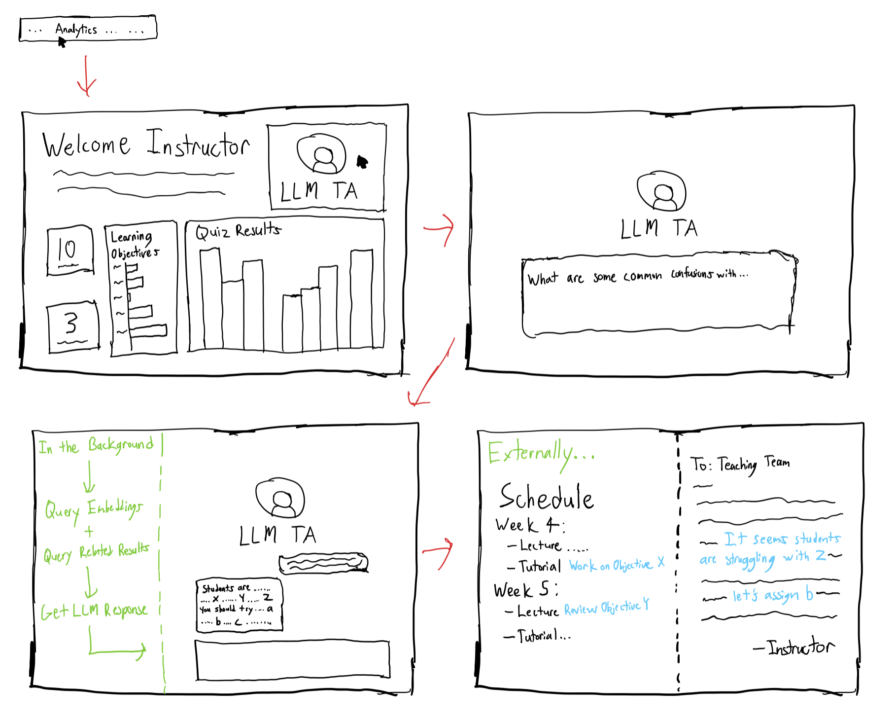
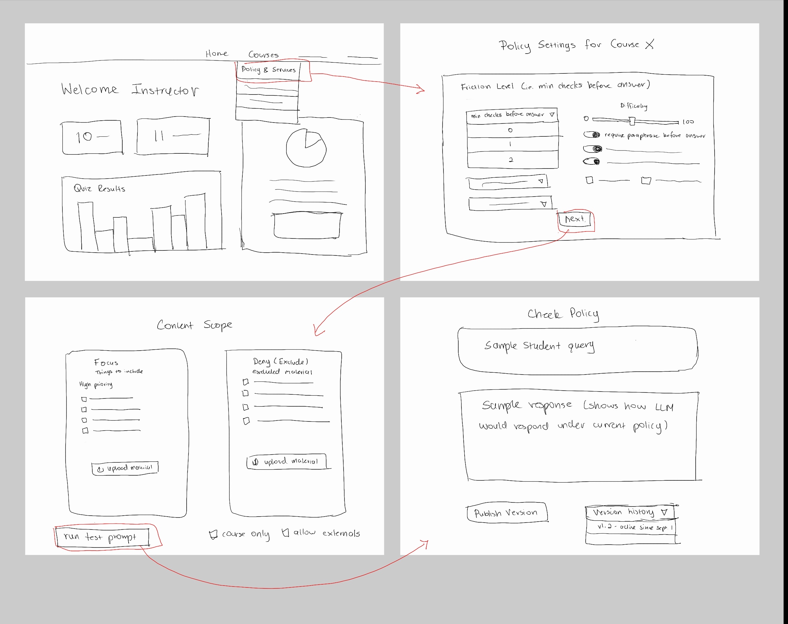

# JTBDs, CUJs, Functional & Non-Functional Requirements

## JTBDs
- **As a university student**, when engaging with course material* (often using digital aids), I want to surface and close my knowledge gaps effectively while staying within institution policies, so I can save time, retain concepts long-term, and apply them confidently on assessments.
- **As a professor/teacher**, when running a course where students may use AI aids, I want to define allowable use and identify misconceptions across topics, so I can maintain academic standards and adjust instruction to improve learning outcomes.

*Course material includes lecture notes, textbooks, slides, assignments, and other resources provided by the instructor or institution.
We will focus on having our platform support pptx and pdf based materials in the first phase.

---

## CUJs

After further discussion, we have updated the CUJs to better reflect our current progress, focus, and priorities. The CUJs have now been divided into 3 categories in regard to their implementation in our MVP phase. Below is a summary of the categories:
1. **Completed CUJs:** These CUJs have been fully (**dynamically**) implemented and are ready for use in our MVP phase.
   - Student CUJ 1 — Start a adaptive learning focused chat
   - Instructor CUJ 1 — Course Material Upload & Quiz Setup (connected to Student CUJ 2)
2. **CUJs in Progress:** These CUJs are currently being worked on and will be fully (**dynamically**) implemented in our MVP phase.
   - Student CUJ 2 — Start a slide based dynamic practice quiz session
   - Instructor CUJ 2 — Diagnose class understanding with Analytics Dashboard v1
3. **Future CUJs:** These CUJs are ones that will be implemented **statically** in our MVP phase to show the direction of our product, but will not be fully functional until a later phase.
   - Student CUJ 3 — Self-directed Flashcard generation & review
   - Instructor CUJ 3 — Configure LLM course policies & content scope

---

### Completed CUJs:
### Student CUJ 1 — Start a adaptive learning focused chat
**Statement:** Begin a chat session that helps me study a topic, with adaptive guidance and friction to keep me focused and on-policy.

**User path:**
1. Student creates a new adaptive chat session.
2. Student asks a question about a course topic. 
3. LLM does not provide a direct answer if the question is too broad or resembles an active assignment. Instead, it guides the user towards the answer by breaking down the problem and having the user reflect or paraphrase (`friction` mode).
4. Student answers the follow-up questions, LLM checks and clarifies any misunderstandings before continuing to guide the user through the topic.
5. After each response, the LLM classifies the turn as `good` or `needs_focusing` based on the quality of the student's input based on the chat context. Good turns are those that show understanding and engagement with the topic, while needs_focusing turns indicate a lack of clarity or depth in the student's input (e.g., vague questions, off-topic, superficial engagement, or fishing for answers).
6. If the user is stuck, but has provided enough `good` turns (can be set by instructor), the next LLM turn can be switched from `friction` mode to `guidance` mode, where the LLM provides more direct explanations and examples to help the student understand the concept.
7. Repeat steps 2–6 until the student feels they have a good grasp of the topic.
8. At any point, the student can ask for a summary of the key points discussed in the chat session to reinforce their understanding.

*Future Work: These next steps may be added in a later phase and are based on [previous versions](use_cases_archive/use_cases_v1.md) of the CUJ.*
9. After each LLM response, the system offers a quick micro-check (MCQ or short answer) to test understanding of the concept just discussed.
10.  When the student returns to the chat later, the LLM first asks about topics that were mentioned in the last session focusing on problem topics.

**UI/UX Sketches:**
The updated Figma design and details can be found in [Student UI/UX Session 1](uiux/student_uiux_1.md). These designs do not align 1 to 1 with the actual CUJ flow, but they give a good idea of the intended user experience and showcase the basis and evolution of our design. 

### Instructor CUJ 1 — Course Material Upload & Quiz Setup (connected to Student CUJ 2)
**Statement:** Upload course materials and set up adaptive quizzes that students can access. View quiz results and analytics to identify student misconceptions on course topics.

**User path:**
1. Instructor opens Quiz Generator → Create a Quiz.
2. Clicks Upload Slide/Notes and selects a pdf/image file then clicks Ingest File.
3. System ingests the file (parse → chunk → index) and allows user to click next.
4. Instructor can then set Quiz title, description, and configure topics (e.g., what subtopics within the slides to focus on).
5. Instructor can then save, delete, or preview the quiz.
6. In preview mode, the instructor can generate and view sample questions one at a time, choosing the difficulty and topic for each question.
7. Once the user is satisfied with the quiz, they can publish it to make it available to students.
8. All of the quizzes created by the instructor are listed in the Quiz Dashboard, allowing them to edit and manage existing quizzes.

*Future work: The current implementation/UI currently shows a practice and assessment quiz option, but for the MVP phase we will only be implementing the practice quiz functionality connected to Student CUJ 2. In future phases we may implement the assessment quiz option as well, which allows finer control over quiz settings such as time limits, number of attempts, and specific predictable/editable questions. In the future we would also like to allow for multiple sources and formats of course materials to be used for quiz generation (e.g., multiple pdfs, pptx, text/image input).*

**UI/UX Sketches:**
The updated Figma design and details can be found in [Instructor UI/UX Session 1](uiux/instructor_uiux_1.md). These designs do not align 1 to 1 with the actual CUJ flow, but they give a good idea of the intended user experience and showcase the basis and evolution of our design.

---

### CUJs in Progress:

### Student CUJ 2 — Start a slide based dynamic practice quiz session
**Statement:** Choose from instructor uploaded slides/materials and take an adaptive, citation-backed quiz that tests understanding and gives recommended next steps.

**User path:**
1. Student opens Assessment & Practice Quizzes → selects a quiz from the list of instructor published quizzes.
2. Loads page showing quiz details (title, description, topics covered) and a list of previous attempts.
3. When Student clicks Start New Attempt, the system begins a new session and generates the first question from the quiz material/details set by the instructor.
4. Questions are presented one at a time, as the student answers → system grades instantly, shows a brief explanation with \[slide N] citation, and records correctness.
5. The quiz adapts: easier/harder items and topic mix adjust based on recent performance.
6. When the user feels they are done, they can click End Session to see a summary of their performance. This summary and the session is saved to their quiz history.
7. Based on the summary, the student can then use the chat feature (Student CUJ 1) to study specific topics they struggled with during the quiz and test their understanding further. (This completes the learning → practice → learning loop.)

*Future work: The following steps may be added in a later phase and are based on [previous versions](use_cases_archive/use_cases_v1.md) of the CUJ.*
Direct Quiz to Study Handoff (similar to NotebookLM - see [Competitive CUJ Analysis](comp_cuj/README.md)):
8. If rolling accuracy drops (e.g., <60% across last 10 items) or repeated misses on a concept, the system recommends Switch to Study Session (Student CUJ 1), listing the problem topic(s) and starting a chat session to focus on those areas.
  
**UI/UX Sketches:**
*Updated UI/UX Design Pending and will be added soon.*

### Instructor CUJ 2 — Diagnose class understanding with Analytics Dashboard v1
**Statement:** View how students are performing on quizzes and trends in how well they are using the adaptive chat to identify misconceptions, and adjust instruction accordingly.

**User path:**
1. Instructor opens → Analytics Dashboard shows tiles: quiz stats, chat stats.
2. Open the Quiz Analytics tab → show and sort results by quiz and performance per topic.
3. Open the Chat Analytics tab → shows comparison of queries by type (good vs needs_focusing) and trends over time.
4. Utilizing this information, the instructor can create new practice quizzes to focus student practice on the most challenging topics. Or the instructor can create assessment quizzes to formally evaluate student understanding over a proper spread of strong and weak topics.
5. Instructor can then use this information externally to adjust course plans (i.e. tutorials) and can recommend topics of study to students during next class.

*Future work: This dashboard is a v1 version and will be expanded in future phases to include more analytics and more in-platform actions for the instructor to take based on the data. Another future addition when more student data is available is the LLM TA feature, which allows instructors to ask natural language questions about class performance and get data-backed answers.*

*Disclaimer: This is the initial UI/UX Sketch and will be updated with the MVP design soon. The design below represents what a version 2 of this CUJ could look like in the future.*
**UI/UX Sketches:**

---

### Future CUJs:

### Student CUJ 3 — Self-directed Flashcard generation & review
**Statement:** Generate flashcards from course materials and review them to practice active recall and reinforce learning.

**User path:**
1. Student opens Flashcards → Create Flashcards. This view will also contain a list of previously created flashcard decks.
2. Uploads course material (pdf/pptx) and clicks Ingest File.
3. System ingests the file (parse → chunk → index) and allows user to click next.
4. Student can then set Flashcard deck title, description, and optionally configure topics and number of cards.
5. System generates flashcards (question + answer) from the ingested material and displays them for review.
6. Student can then start a review session, where flashcards are presented one at a time.
7. For each flashcard, the student attempts to recall the answer before revealing it. After revealing, the user can mark whether they got it right or wrong.
8. The system tracks performance and shows flashcards until all were marked correct in a session. Cards that were marked wrong are prioritized for review in subsequent sessions.

**UI/UX Sketches:**
UI/UX Design Pending and will be added soon.

### Instructor CUJ 3 — Configure LLM course policies & content scope
**Statement:** Set course-level AI policy and choose what knowledge sources are allowed so student help stays on-policy and aligned to instructional goals.

**User path:**
1. Instructor opens Course → Policy & Sources.
2. Sets Friction level (i.e. min checks before answer) and toggles “require paraphrase before answer.”
3. Chooses Content scope: Course-only, Suggest externals, or Allow externals.
4. Manages Focus list (notes/FAQs to emphasize) and Deny list (assignments/solutions to exclude).  
   a. Upload specific materials for the above lists.
5. Runs a policy check/preview (test prompt): graded-work request is blocked; concept help follows friction rules; answers cite only allowed sources. Instructor can iterate on settings based on preview results.
6. Presses publish updated and pushing policies to the student side.

**UI/UX Sketches:**

---

## Functional Requirements (FR)

The functional requirements build on the CUJs above. Each CUJ has a set of functional requirements (FR) that define the capabilities needed to support the user journey. This is supported by non-functional requirements (NFR) that define system qualities like performance, scalability, reliability, security, and maintainability.
Each FR and NFR has an ID, description, and acceptance criteria. These requirements are then referenced by Github issues outlining the timeline of our implementation. These issues are then further grouped into milestones representing key phases of development.

**Disclaimer:** These requirements are a starting point and the acceptance criteria is our current prediction/understanding of what needs to be done. They will evolve as we learn more about the problem space, user needs, and technical constraints. Issues will be edited with more details and finalized deadlines once we better understand the work needed. This list also serves as an exhaustive list of features we may want to build, but it is possible not all will be implemented in the initial release. Requirements that are prioritized or pushed back will be reflected in this document and in updates to the milestones/roadmap.

### A) Student CUJ 1 — Policy-compliant Study & Learning Chat (FR-C)

#### FR-C1 — Chat UI (step-by-step coaching)
Provide numbered, reasoning-first guidance (no final solutions for graded work).
**Accept:** Given a coding/problem prompt, the response includes numbered steps and guidance; direct answers to active assignments are refused with a tutorial pivot.

#### FR-C2 — Turn classification
Classify each question as `{good | needs_focusing}` to drive behavior.  
**Accept:** Every turn is labeled and persisted as `{good | needs_focusing}`.

#### FR-C3 — Adaptive friction
When needed, require focus (subtopic or paraphrase) before answers; give concise guidance otherwise.  
**Accept:** `needs_focusing` turns demand a subtopic or ≥15-word paraphrase before a substantive answer; `good` turns receive a concise answer with 2–3 follow-ups.

#### FR-C4 — Active recall and study continuation
Offer a quick micro-check after each turn and prompts for next steps.  
**Accept:** Each turn triggers an MCQ/short-answer to check understanding and/or related questions/suggestions to continue studying.

#### FR-C5 — Memory & revisit
Persist state and start next session from problem topics.  
**Accept:** Sessions resume by referencing the last session’s problem topics/open reviews.

---

### B) Student CUJ 2 — Slide-based Dynamic Quiz (FR-Q)

#### FR-Q1 — Upload & ingest
Accept PDF/Image and index for quizzing.  
**Accept:** On upload of PDF or image with text, the application cites page or line references in its response during the quiz.

#### FR-Q2 — Quiz generation
Generate quizzes from slides with multiple formats (e.g. MCQ, short answer).  
**Accept:** For a 50-slide deck, ≥10 review questions are generated with \[slide N] references.
*Update: We will be discussing the specific requirements for the question generation and grading with the team and will update this section soon.*

#### FR-Q3 — Instant grading & explain
Grade each attempt with a brief explanation and citation.  
**Accept:** Each answer returns correctness plus a short explanation that cites a valid \[slide N].

#### FR-Q4 — Adaptivity
Adjust difficulty/topic mix within the session.  
**Accept:** Subsequent items reflect recent accuracy and concept mastery changes.

#### FR-Q5 — Struggle → study handoff
Recommend study session when sustained struggle is detected.  
**Accept:** If rolling accuracy <60% (last 10) or ≥3 misses on a concept, a study-session recommendation with 3–5 targeted topics and slide links is shown.

---

### C) Instructor CUJ 1 — Configure LLM Policies & Content Scope (FR-P)

#### FR-P1 — Policy editor
Set friction level, require-paraphrase, and content scope (course-only/limited externals/full).  
**Accept:** Saved settings persist per course and are previewable in a student banner.

#### FR-P2 — Resource controls
Manage Focus (emphasize) and Deny (exclude) lists; upload/link resources.  
**Accept:** Emphasize/Exclude flags persist and are enforced by retrieval.

#### FR-P3 — Preview & publish
Test a policy prompt and publish a versioned policy.  
**Accept:** Policy test shows on-policy behavior and a versioned policy is published and visible.

#### FR-P4 — Runtime enforcement
Apply policy during chat/quiz.  
**Accept:** Excluded resources never appear, friction rules apply, and scope limits (e.g., course-only) are respected at runtime.

---

### D) Instructor CUJ 2 — Analytics + “LLM TA” (FR-A)

#### FR-A1 — Dashboard
Show cohort accuracy/completion, top missed objectives, and trends with filters.  
**Accept:** The dashboard shows a general overview of struggle concepts, quiz performance, and the LLM TA.

#### FR-A2 — Weak-spot detection
Clusters misconceptions and hardest concepts this week.  
**Accept:** For any 7-day window, list the top 5 concepts that students are struggling with the most.

#### FR-A3 — LLM TA Q&A
Let instructors ask natural-language questions grounded in class data.  
**Accept:** Answers cite class metrics and anonymized excerpts and propose specific follow-ups.

#### FR-A4 — Flag & corrections
Allow flagging poor answers and submitting corrections.  
**Accept:** Flagged items appear in a review queue and corrections are stored for future improvement.

---

### F) Cross-cutting (FR-X)

#### FR-X1 — Auth & roles
Enforce RBAC (Student/Instructor/Admin) with course/section scope.  
**Accept:** All API routes verify role and scope before processing.

#### FR-X2 — Content safety
Detect/deny graded-work asks; honor deny lists end-to-end.  
**Accept:** Graded-work requests are refused with policy reminder and deny-listed resources are excluded in ingest/retrieve/display.

#### FR-X3 — Telemetry & cost
Log tokens, latency, cost, question_type, friction_used, citations_count, and policy_version per turn.  
**Accept:** Each turn writes a telemetry record with these fields.

---

## Non-Functional Requirements (NFR)

### Performance (NFR-P)

#### NFR-P1 — Chat latency
Fast perceived response for coaching.  
**Accept:** Median ≤10.0s for short questions and ≤20.0s with retrieval/citations.

#### NFR-P2 — Ingestion time
Timely slide indexing.  
**Accept:** A 50-page deck completes parse→index in ≤2 min with progress visible.

#### NFR-P3 — Adaptivity overhead
Lightweight decisioning.  
**Accept:** Turn classification + adaptivity compute in ≤300 ms.

---

### Scalability & Cost (NFR-SC1)

#### NFR-SC1 — Concurrency
Support peak usage.  
**Accept:** System sustains a class of up to 500 concurrent student sessions and a teaching team of 20 instructors.

#### NFR-SC2 — Cost guardrails
Keep spend predictable.  
**Accept:** Average coaching interaction ≤$0.01, ≤$0.03 with RAG/citations.

---

### Reliability and Accuracy (NFR-RA)

#### NFR-RA1 — LLM response uptime/robustness
Robust jobs and calls.  
**Accept:** LLM/ingest tasks auto-retry with backoff.

#### NFR-RA2 — No fabrication and hallucinations
Be honest in low context; no LLM hallucinations.  
**Accept:** Low/empty retrieval triggers a “don’t know + review” reply with 0 fabricated citations in tests. Hallucinations are kept to a minimum (1 in every 1000 queries).

---

### Security & Privacy (NFR-SP)

#### NFR-SP1 — Personal data hygiene
Respect learner privacy.  
**Accept:** Raw PII is not stored in prompts; data is encrypted in transit/at rest.

#### NFR-SP2 — Student and Instructor data privacy
Ensure private chat/assignment data cannot be reached by other students through the LLM.  
**Accept:** Private instructor and student chat data is stored properly and only used for use with respective users.

---

### Accessibility & UX (NFR-UX)

#### NFR-UX1 — WCAG compliance
Inclusive by default.  
**Accept:** Core flows pass checks for WCAG 2.1 AA.

#### NFR-UX2 — Streaming UX
Responsive interaction.  
**Accept:** Responses stream LLM replies incrementally (SSE/WebSocket).

---

### Maintainability & Portability (NFR-M)

#### NFR-M1 — Tests
Confidence in reliability and performance, ready to ship.  
**Accept:** Backend coverage ≥70% and each CUJ has a passing happy-path test.

#### NFR-M2 — Swappability
Avoid vendor lock-in.  
**Accept:** Embeddings provider, vector store, and OpenRouter model are swappable behind interfaces.

---

## Appendix: Outline

- **JTBDs**
- **CUJs**
  - Student CUJ 1 — Start a policy compliant study and learning chat
  - Student CUJ 2 — Start a slide based dynamic quiz session
  - Instructor CUJ 1 — Configure LLM policies & content scope
  - Instructor CUJ 2 — Diagnose class understanding with Analytics + “LLM TA”
- **Functional Requirements (FR)**
  - A) Student CUJ 1 — Policy-compliant Study & Learning Chat (FR-C)
  - B) Student CUJ 2 — Slide-based Dynamic Quiz (FR-Q)
  - C) Instructor CUJ 1 — Configure LLM Policies & Content Scope (FR-P)
  - D) Instructor CUJ 2 — Analytics + “LLM TA” (FR-A)
  - F) Cross-cutting (FR-X)
- **Non-Functional Requirements (NFR)**
  - Performance (NFR-P)
  - Scalability & Cost (NFR-SC1)
  - Reliability and Accuracy (NFR-RA)
  - Security & Privacy (NFR-SP)
  - Accessibility & UX (NFR-UX)
  - Maintainability & Portability (NFR-M)
